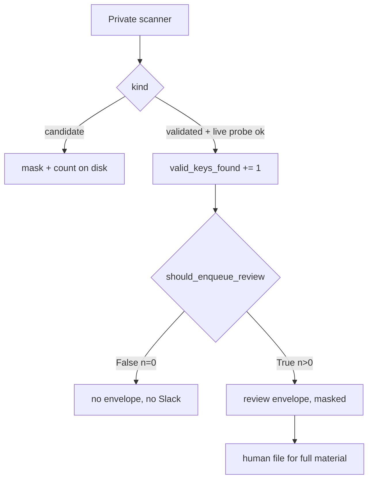

# White-hat Secret Policy

**If you only open one file, open [`START_HERE.md`](START_HERE.md).**


White-hat Secret Policy is a tiny Python gate that lets a leak-finder
**enqueue human review only when `valid_keys_found > 0`**. Candidates
(entropy or prefix hits that were never live-proved) stay masked on
disk. The finder process does not Slack.

Gitleaks `[[allowlists]]` skip *detection* so CI does not fail on a
known fixture. TruffleHog `--results=verified` still prints the raw
key on the **same channel** as the scanner (`Raw result:` in their
README). Neither splits **notify** from **find**. Scanners that
optimize recall and dump chat train humans to mute the channel.
This repo is **policy + `review_gate.py`**, not a turnkey hunter
(no detector regex source, no HTTP validators).

Suggested GitHub / PyPI name: **`whitehat-secret-policy`**

## Who it helps

| Who | What they get |
| --- | --- |
| **You (the technician)** | `should_enqueue_review(n)` is True only when `n > 0`. `ESCALATE` with zero validated keys is a contract error. |
| **AI agents / harnesses** | No `dump_slack` / `validate_leaked_key` tool. Candidates stay masked. |
| **People talking to those agents** | Alerts that mean a *validated* leak, not regex noise. |

## Who should skip this

Teams that only run Gitleaks as a pre-commit hook and never page
humans from a scanner. People who already refuse to auto-disclose
and already treat unverified hits as counts. Anyone asking for a
copy-paste exploit kit, dork YAML, or a live-key HTTP client —
read `SECURITY.md`.

## How it connects to AI agents



| Style | When |
| ----- | ---- |
| **In-process** (recommended) | Your hunter calls `should_enqueue_review(valid_keys_found)` then files an envelope in a *different* process. |
| **Harness** | Paste the policy. Do **not** give the model `validate_leaked_key` or `send_slack`. |
| **Both** | Scanner writes; humans and chat models inspect the envelope, never the raw key. |

This kernel has **no** MCP server. Pair `agent-review-envelope` when
the gate is True. Do not copy that sibling’s schema strings into
this file.

## 10-minute first success

```bash
chmod +x scripts/smoke.sh
./scripts/smoke.sh
# optional
python3 -m pip install -e .
python3 examples/quickstart.py
```

Success is `smoke ok` plus printed `0 keys → review? False` and
`2 keys → review? True`. `ESCALATE with 0 keys` is a contract error.
That rigidity is the product.

## Hardware / software

| Resource | Minimum |
| -------- | ------- |
| OS | Linux, macOS, or Windows with Python **3.10+** |
| RAM | Trivial (two functions) |
| GPU | **None** |
| Network | **None** for this library. Live probes, if you implement them, stay in a *private* tree and stay read-only + budgeted. |

No extra dependencies. This repo does not ship a scanner.

## Repository layout

| File | What it does | What you change it for |
| ---- | ------------ | ---------------------- |
| `START_HERE.md` | First-use, 10 minutes | You usually do not |
| `README.md` | Product + hidden dynamics | Forks / rename |
| `docs/hero.png` | Banner | Branding |
| `docs/INTEGRATION.md` | Gate + envelope recipes | Your hunter’s count |
| `docs/ADVANCED.md` | Slack fatigue (search article) | Architecture debates |
| `CAPABILITIES.md` | Policy inventory (kinds, knobs) | Prefix *summaries* only |
| `review_gate.py` | `should_enqueue_review` | Almost never |
| `examples/quickstart.py` | 0 vs 2 keys | Learning |
| `tests/` | Gate + dual-use surface | Behavior changes |
| `scripts/smoke.sh` | unittest + quickstart | CI locally |
| `.env.example` | Env **names** | Copy to `.env` (never commit `.env`) |

## Related kernels

| Kernel | Why |
| ------ | --- |
| `agent-review-envelope` | When the gate is True, file JSON for a *different* process to judge. This kernel must not Slack. |
| `agent-loop-guardrails` | `ESCALATE` with zero validated keys is the contract error this gate flags. |
| `casualty-aware-watchdog` | Another “do not page from the finder process” policy (dead API, not secrets). |
| [Curiosity-Docker](https://github.com/CynicalTyr/Curiosity-Docker) | House-style START_HERE. Not a hunter. |

## What others will discover (that demos hide)

These dynamics show up **after** someone else runs this in a real loop.
Ordinary READMEs skip them; they are why the kernel exists.

| Lens | In this kernel |
| ---- | -------------- |
| **Hidden principle** | Validated must not equal candidate. A competent engineer still pages on regex hits because “we found something.” Per the Cynical0n3 NotebookLM (`systems`): a candidate is “looks reasonable”; validated needs out-of-band proof. |
| **Recurring pattern** | Detector engine (probabilistic search) ≠ policy engine (who to notify). Review enqueue only if `valid_keys_found > 0`. Never auto-disclose. |
| **Mental model** | Adopters think Gitleaks allowlists *are* notify policy, and TruffleHog `--results=verified` *is* dual-control. Allowlists skip detection. `--results=verified` still prints `Raw result` on the scanner channel. |
| **Feedback loop** | Measure findings/night → entropy detector wins → humans mute Slack → real keys ignored (NotebookLM `systems`: cognitive surrender / alert storms). |
| **Hidden incentive** | “Just Slack it” is the shortest path to looking useful. White-hat (mask, budgeted read-only probe, human file) is the expensive path. |
| **Leverage point** | `should_enqueue_review`. `DETECT_ONLY`. Per-run probe budget. `escalate_is_contract_error`. |
| **Asymmetry** | Read-only GET /models is still using a stolen credential. Budget it. Do not POST payments. Do not implement “use the key to do something useful.” |
| **Cause → effect** | Recall-optimized scanner + chat → blast-radius expansion (unredacted secret in a shared channel) + mute. Gate + human file → dual-control. |
| **Second-order** | Once copied, teams will chart “secrets found” and add a Slack webhook “just for verified.” That metric is the incident. Count envelopes that reached a human vs pages from the finder process. |
| **Opportunity** | Agent hunters and CI scanners that page. Search: *secret scanner slack fatigue*. |
| **Risk if copied blindly** | Public regex dumps and HTTP validator clients. Dual-use is the upload risk. Keep this tree policy-only. |

**Hidden principle:** anything deterministic logic can solve never
goes to a probabilistic model — per the Cynical0n3 NotebookLM
(`systems`). Pattern-matching (discovery) stays isolated from
rule-bound gatekeeping (enforcement). The detector flags the
candidate; this policy decides whether a human may be notified,
how the secret is redacted, and when to refuse `ESCALATE`.

**Mental model:** adopters think “verified” means “safe to print”
and “allowlist” means “we thought about paging.” Gitleaks
`config/allowlist.go` / `[[allowlists]]` ignore commits, paths, and
stopwords so the *scanner* stays quiet. TruffleHog `main.go`
`--results=verified` (and hidden `--only-verified`) filters
*output kinds* after API tests — DeepWiki still places a
ResultsDispatcher on the engine. Neither requires a second process
before a human sees the raw key.

**Second-order:** findings-per-night dashboards will reward dumping
candidates. NotebookLM (`systems`): auto-disclosing unredacted
secrets to Slack turns a restricted-repo leak into a wide, indexed
plain-text credential leak. Keep `should_enqueue_review(0)` False.
Do **not** add `force_notify`.

Deeper case studies: [`docs/ADVANCED.md`](docs/ADVANCED.md). Wiring:
[`docs/INTEGRATION.md`](docs/INTEGRATION.md).

## License

MIT. See `LICENSE`.

## Coffee and energy fund

If the gate kept Slack quiet and you want more policy kernels, you can chip in to CynicalTyr's coffee and energy fund. Nobody owes a cent.

<a title="Donate with PayPal" href="https://www.paypal.me/ctmskm" target="_blank" rel="noopener"></a><a title="Donate with CashApp" href="https://cash.app/$MooseMeNow" target="_blank" rel="noopener"></a> <a title="Donate with Venmo" href="https://venmo.com/MooseMeNow" target="_blank" rel="noopener"></a>
