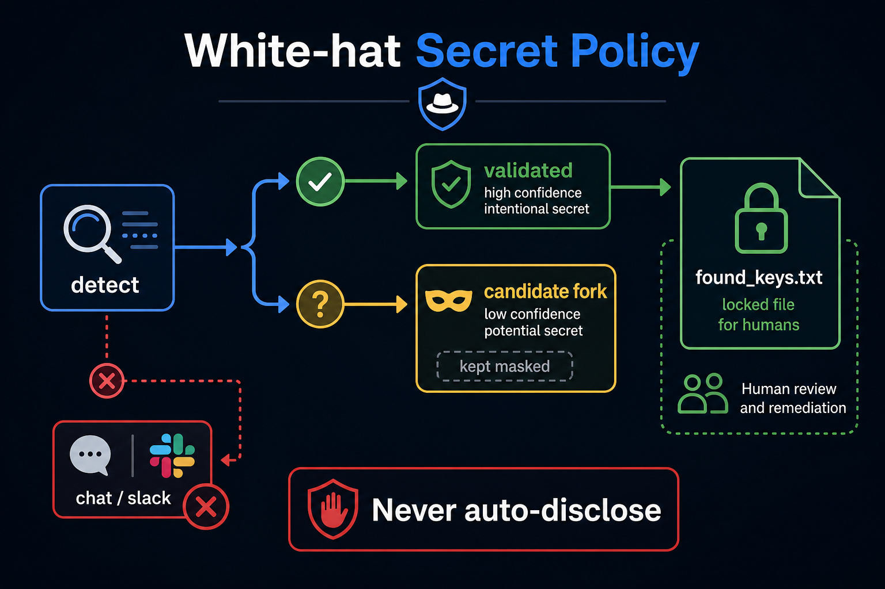

# White-hat Secret Policy

**If you only open one file, open [`START_HERE.md`](START_HERE.md).**



**One sentence:** a leak-finder stays white-hat when **`validated` ≠
`candidate`**, live probes are read-only and budgeted, and systems review
fires **only** when `valid_keys_found > 0`.

**Value proposition:** Scanners that optimize recall and dump Slack train
humans to mute the channel. This repo is **policy + a tiny gate
function**, not a turnkey hunter (no detector regex source, no HTTP
validators).

Suggested GitHub name: **`whitehat-secret-policy`**

## Who it helps

| Who | What they get |
| --- | --- |
| **You (the technician)** | A gate: review only when `valid_keys_found > 0`. Policy, not a scanner. |
| **AI agents / harnesses** | No “dump Slack” tool. Candidates stay masked. |
| **People talking to those agents** | Alerts that mean a *validated* leak, not regex noise. |

## 10-minute first success

```bash
cd hunter-capabilities
python3 -m pip install -e .
python3 examples/quickstart.py
python3 -m unittest discover -s tests -q
```

`0 keys → review? False` · `2 keys → review? True`

## Who should skip

Anyone asking for a copy-paste exploit kit. Read `SECURITY.md`.

## Related

`agent-review-envelope` · `agent-loop-guardrails` · MIT

## What others will discover (that demos hide)

These dynamics show up **after** someone else runs this in a real loop.
Ordinary READMEs skip them; they are why the kernel exists.

| Lens | In this kernel |
| ---- | -------------- |
| **Recurring pattern** | validated ≠ candidate. Review enqueue only if valid_keys_found > 0. Never auto-disclose. |
| **Feedback loop** | Measure findings/night → entropy detector wins → humans mute Slack → real keys ignored. |
| **Hidden incentive** | “Just Slack it” is the shortest path to looking useful. White-hat is the expensive path. |
| **Leverage point** | DETECT_ONLY and per-run probe budget. ESCALATE with 0 keys is a contract error (loop-guardrails). |
| **Asymmetry** | Read-only GET /models is still using a stolen credential. Budget it. Do not POST payments. |
| **Cause → effect** | Recall-optimized scanner + chat → incident. Gate + human file → dual-control. |
| **Opportunity** | Policy ranks for secret scanner fatigue without shipping a weapon. |
| **Risk if copied blindly** | Public regex dumps. This repo must stay policy-only. Dual-use is the upload risk. |

Deeper case studies: [`docs/ADVANCED.md`](docs/ADVANCED.md). Wiring: [`docs/INTEGRATION.md`](docs/INTEGRATION.md).


## License

MIT. See `LICENSE`.
